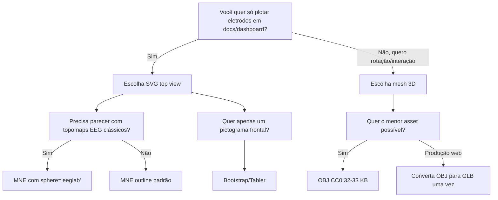

# Assets leves de cabeça 3D e SVG para EEG no PyData e no eegdash

## Resumo executivo

Para um webpage em PyData/eegdash que só precisa **mostrar a cabeça e sobrepor eletrodos com coordenadas**, a melhor escolha quase sempre é **SVG top view no estilo MNE/EEGLAB**, não um mesh 3D completo. O motivo é prático: MNE já define geometricamente a cabeça com **círculo, nariz e orelhas** para topomaps, e a própria documentação atual do MNE expõe a opção `sphere='eeglab'` para reproduzir a convenção 10–20/EEGLAB em 2D. Isso dá um asset quase sem peso, fácil de embutir inline, responsivo e muito mais simples para casar com coordenadas de eletrodos. citeturn40view0turn40view1turn34view0turn34view2

Se você quiser um **viewer interativo 3D** com rotação, meu melhor achado foi o pacote **2 Human Head Basemeshes** do OpenGameArt, em especial o arquivo `human_head_basemesh_male.obj` ou `human_head_basemesh_female.obj`: ambos são **CC0**, têm cerca de **33 KB / 32 KB**, e a malha é extremamente leve (**776 / 760 tris**), o que é raro em cabeças humanas baixas e ainda usáveis para web. Para produção, eu faria uma conversão única para GLB e usaria esse GLB no cliente; mas mesmo em OBJ ele já é pequeno o suficiente para protótipos. citeturn17view0turn41view0turn41view1

Também priorizei fontes oficiais, especialmente docs do MNE, páginas oficiais de ícones e repositórios/páginas de download em entity["company","GitHub","code hosting platform"] ou sites oficiais dos projetos. Onde o projeto **não publica um arquivo bruto simples**, mantive o link oficial com **botão de download** ou **SVG copiável** e deixei isso explícito. citeturn25search1turn26search3turn30view0

## Critério de escolha

A bifurcação principal é esta: se o objetivo é **documentação estática, top view e overlay preciso**, prefira SVG; se o objetivo é **rotação, perspectiva, hover em profundidade e cena 3D**, prefira um head mesh bem leve. Isso decorre do próprio modo como MNE/EEGLAB renderizam mapas de sensores em 2D projetados sobre um círculo de cabeça, enquanto meshes 3D são mais úteis quando a orientação espacial importa visualmente. citeturn34view0turn34view2turn40view0



image_group{"layout":"carousel","aspect_ratio":"1:1","query":["MNE EEG topomap head outline", "Bootstrap person-circle icon", "Tabler user-circle icon", "2 Human Head Basemeshes OpenGameArt"],"num_per_query":1}

## Comparativo dos candidatos

Quando aparece `~` no tamanho abaixo, é **estimativa** baseada no fato de o SVG ser copiado inline ou gerado em runtime, não um arquivo pesado separado.

| Nome | Formato | URL | Licença | Tamanho | Notas de adequação | Uso sugerido |
|---|---|---|---|---:|---|---|
| **MNE outline padrão** | SVG inline gerado por código | [código-fonte](https://github.com/mne-tools/mne-python/blob/main/mne/viz/topomap.py) | BSD-3-Clause | sem arquivo externo; ~1–2 KB inline | O código do MNE define explicitamente `head`, `nose`, `ear_left` e `ear_right`; é o melhor ponto de partida para uma representação EEG-style bem leve. Excelente para overlay 2D de eletrodos. citeturn40view0turn40view1turn33view0 | **SVG para docs** |
| **MNE com convenção EEGLAB** | SVG inline / preset geométrico | [exemplo oficial .py](https://mne.tools/0.24/_downloads/a4921072acc135828760714b86be20cc/eeglab_head_sphere.py) | BSD-3-Clause | sem arquivo externo; ~1–2 KB inline | É o mais fiel à convenção EEG 10–20 usada em topomaps tipo EEGLAB. O MNE documenta que esse modo coloca o círculo da cabeça na circunferência medida por Fpz/T7/T8/Oz e hoje também aceita `sphere='eeglab'`. citeturn34view0turn34view1turn34view2turn35view0 | **Melhor escolha para docs estáticos** |
| **Bootstrap Icons `person-circle`** | SVG | [download SVG](https://icons.getbootstrap.com/assets/icons/person-circle.svg) | MIT | ~0.3–0.5 KB inline | Muito leve e oficial; porém é um ícone frontal simbólico e **não** traz orelhas/nariz/top view adequados para posicionamento EEG real. Serve melhor como placeholder ou avatar frontal. citeturn28view0turn29view0 | SVG frontal superleve |
| **Tabler Icons `user-circle`** | SVG | [página oficial com SVG copiável](https://tabler.io/icons/icon/user-circle) | MIT | ~0.4–0.7 KB inline | Também muito leve e com stroke limpo em 24×24. Assim como o Bootstrap, funciona bem como outline frontal, mas não como cabeça EEG top view rigorosa. citeturn30view0turn9search4 | SVG frontal para UI |
| **2 Human Head Basemeshes — male** | OBJ | [download OBJ](https://opengameart.org/sites/default/files/human_head_basemesh_male.obj) | CC0 | **33.1 KB** | Um dos melhores achados para web: OBJ minúsculo, **776 tris**, UV rápido, malha simples e fácil de converter para GLB. Muito bom para um viewer 3D sem exagero de polígonos. citeturn17view0turn41view0 | **Melhor base para viewer 3D** |
| **2 Human Head Basemeshes — female** | OBJ | [download OBJ](https://opengameart.org/sites/default/files/human_head_basemesh_female.obj) | CC0 | **32.4 KB** | Quase a mesma proposta do male: **760 tris**, igualmente leve e adequada para conversão a GLB. Escolha esta se preferir uma silhueta um pouco diferente, mas para EEG a diferença prática é mínima. citeturn17view0turn41view1 | Viewer 3D ou GLB leve |
| **Brain and Skull — `head.obj`** | OBJ | [download OBJ](https://opengameart.org/sites/default/files/head_0.obj) | CC0 | **304.8 KB** | Ainda é leve para web, mas já é bem mais pesado que os basemeshes de 32–33 KB. O autor descreve o conjunto como modelo anatômico com quase **6000 vértices / 12000 triângulos** e pele/face incluídas; eu usaria só se você quiser um 3D um pouco mais “anatômico”. citeturn14view0turn41view2 | 3D interativo mais anatômico |

## Recomendação final

### Melhor escolha para docs estáticos

A melhor opção para seu caso é **MNE com convenção EEGLAB**, exportado como um **SVG top view mínimo** e embutido inline na página. Esse caminho reúne quase tudo que você pediu ao mesmo tempo: é extremamente leve, tem licenciamento permissivo BSD, já nasce no ecossistema EEG, inclui os elementos visuais que importam para o usuário reconhecer a cabeça, e casa naturalmente com um sistema de coordenadas 2D de eletrodos. Além disso, a documentação atual do MNE mostra explicitamente que você pode usar `sphere='eeglab'` quando quiser desenhar o círculo da cabeça na convenção 10–20/EEGLAB. citeturn34view0turn34view2turn40view0turn40view1

Na prática, eu faria assim: pegar a geometria do MNE, congelar em um único SVG com `viewBox` fixo, e manter as posições dos eletrodos no **mesmo sistema de coordenadas** do SVG. Isso evita qualquer drift visual entre cabeça e sensores e dispensa runtime 3D. Como inferência de implementação, esse é o caminho com menor atrito para PyData docs, Sphinx e páginas estáticas. citeturn34view2turn40view0

### Melhor escolha para viewer interativo

Para um viewer interativo, eu escolheria **`human_head_basemesh_male.obj`** do pacote **2 Human Head Basemeshes** e faria uma conversão única OBJ → GLB antes de publicar. A razão não é “realismo”; é **economia de bytes e simplicidade de malha**. Com ~33 KB e 776 tris, ele é leve o suficiente para página web, simples o bastante para não atrapalhar a leitura de marcadores, e permissivo o suficiente para uso sem fricção. O arquivo female é praticamente equivalente; se você quer uma única cabeça só para ter volume 3D, qualquer um dos dois serve. citeturn17view0turn41view0turn41view1

Eu só subiria para o `head.obj` do **Brain and Skull** se você realmente quiser um volume mais anatômico; caso contrário, o ganho visual geralmente não compensa o aumento de peso e complexidade para um dashboard de EEG. citeturn14view0turn41view2

## Snippets e demos úteis

Os dois links oficiais mais úteis para começar rápido são o **exemplo do MNE para projeção estilo EEGLAB** e as **páginas oficiais de SVG copiável** dos ícones do Bootstrap/Tabler. O exemplo do MNE já mostra o raciocínio de projeção de sensores e o papel do argumento `sphere`; já Bootstrap e Tabler entregam SVG pronto para copiar/colar. citeturn35view0turn28view0turn30view0

### Exemplo mínimo de SVG inline com overlay de eletrodos

```html
<svg viewBox="-110 -115 220 230" width="320" height="320" aria-label="EEG head">
  <!-- cabeça -->
  <circle cx="0" cy="0" r="95" fill="none" stroke="currentColor" stroke-width="2"/>

  <!-- nariz -->
  <path d="M -18 -93 L 0 -109 L 18 -93" fill="none" stroke="currentColor" stroke-width="2"/>

  <!-- orelhas simplificadas -->
  <path d="M -95 -8 C -104 -2 -104 14 -96 25" fill="none" stroke="currentColor" stroke-width="2"/>
  <path d="M 95 -8 C 104 -2 104 14 96 25" fill="none" stroke="currentColor" stroke-width="2"/>

  <!-- eletrodos -->
  <g id="electrodes"></g>
</svg>

<script>
  const electrodes = [
    { name: "Fpz", x: 0, y: -82 },
    { name: "Cz",  x: 0, y: 0 },
    { name: "Oz",  x: 0, y: 78 },
    { name: "T7",  x: -82, y: 0 },
    { name: "T8",  x: 82, y: 0 }
  ];

  const g = document.getElementById("electrodes");

  for (const ch of electrodes) {
    const c = document.createElementNS("http://www.w3.org/2000/svg", "circle");
    c.setAttribute("cx", ch.x);
    c.setAttribute("cy", ch.y);
    c.setAttribute("r", 4);
    c.setAttribute("fill", "currentColor");
    c.setAttribute("data-name", ch.name);
    g.appendChild(c);
  }
</script>
```

### Exemplo mínimo de viewer 3D com GLB

```js
import * as THREE from "three";
import { GLTFLoader } from "three/addons/loaders/GLTFLoader.js";

const scene = new THREE.Scene();
const camera = new THREE.PerspectiveCamera(45, innerWidth / innerHeight, 0.1, 100);
camera.position.set(0, 0.05, 0.35);

const renderer = new THREE.WebGLRenderer({ antialias: true, alpha: true });
renderer.setSize(innerWidth, innerHeight);
document.body.appendChild(renderer.domElement);

scene.add(new THREE.AmbientLight(0xffffff, 1.2));

const loader = new GLTFLoader();
loader.load("/assets/head.glb", (gltf) => {
  const head = gltf.scene;
  head.scale.setScalar(1);
  scene.add(head);

  // eletrodo de exemplo
  const geo = new THREE.SphereGeometry(0.004, 12, 12);
  const mat = new THREE.MeshBasicMaterial();
  const electrode = new THREE.Mesh(geo, mat);
  electrode.position.set(0, 0.095, 0.01); // ajuste ao seu sistema
  scene.add(electrode);
});

function animate() {
  requestAnimationFrame(animate);
  renderer.render(scene, camera);
}
animate();
```

## Observações práticas de implementação

Se o seu objetivo é **plotar coordenadas** e não vender “realismo”, eu manteria a arquitetura do componente em dois modos. O primeiro modo seria um **SVG top view** no estilo MNE/EEGLAB para docs, screenshots, exemplos e páginas de referência. O segundo seria um **viewer 3D opcional** carregado sob demanda, usando um único GLB derivado de um dos basemeshes OBJ do OpenGameArt. Isso reduz peso inicial, evita JavaScript 3D desnecessário em páginas estáticas e ainda preserva uma visualização rica quando você realmente quiser girar a cabeça. A recomendação é uma inferência de engenharia baseada no fato de que MNE/EEGLAB já trabalham nativamente com topografias 2D e de que os basemeshes CC0 encontrados aqui são pequenos o bastante para uma camada 3D opcional. citeturn34view0turn34view2turn17view0turn41view0

Há também uma diferença sutil, mas importante, entre “ícone de cabeça” e “cabeça EEG”. Ícones frontais como **Bootstrap `person-circle`** e **Tabler `user-circle`** são ótimos para UI e placeholders, mas não são bons para posicionar eletrodos com leitura científica. Para isso, o asset certo é o **outline top view** com nariz/orelhas ou um **head mesh discreto**. citeturn28view0turn30view0turn40view0

Se eu tivesse que decidir agora, sem overengineering, eu faria exatamente isto: **SVG top view MNE/EEGLAB para o componente padrão do eegdash** e **`human_head_basemesh_male.obj` convertido para GLB** como opção avançada de visualização interativa. citeturn34view2turn17view0turn41view0